<p align="center">
  
</p>

<h1 align="center">FitForge</h1>

<p align="center">
  <strong>Strava for strength training.</strong><br/>
  A mobile app to log, track, and analyze your weight training workouts.<br/>
  Built with a focus on capturing the nuance of strength training that existing apps miss.
</p>

<p align="center">
  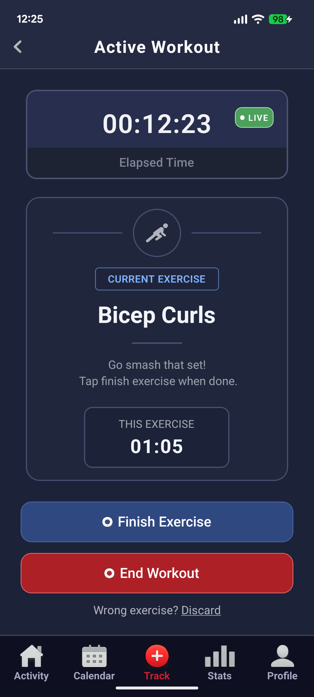
  &nbsp;&nbsp;&nbsp;
  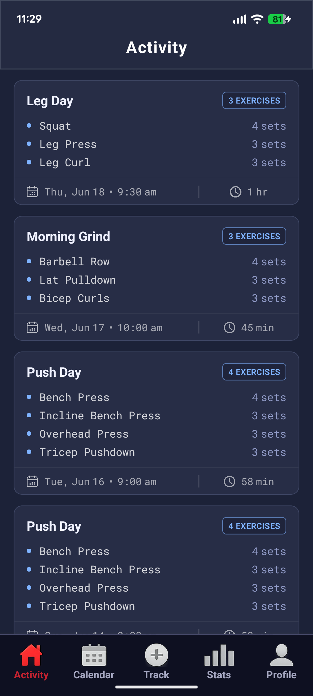
  &nbsp;&nbsp;&nbsp;
  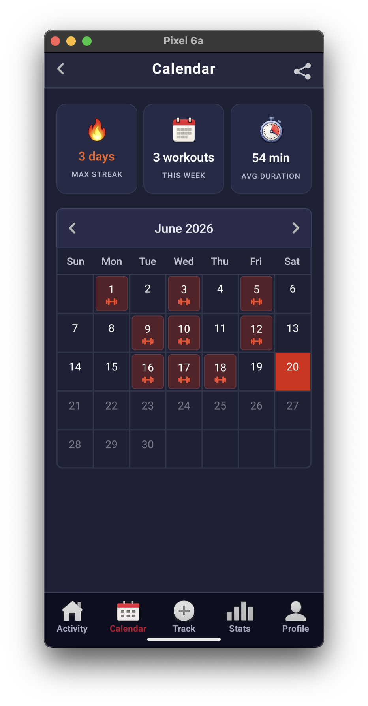
</p>

---

## Why FitForge?

There's no good, well-known app dedicated to strength training tracking. Most fitness apps are either running-focused (like Strava) or overly complex with meal plans and macro tracking. FitForge does one thing: help you systematically log your weight training sessions and understand your progress over time.

## Features

**Flexible Workout Logging**
- **Live workouts**: Log sets, reps, and weight as you train
- **Backdated workouts**: Add completed workouts after the fact
- **Routine-based workouts**: Save custom routines and reuse them across sessions

**Workout Management**
- Create and edit custom routines with sets, reps, and rest times
- Build your own exercise library on top of pre-built exercises
- Full CRUD operations for routines and exercises

**Progress Tracking**
- Calendar view to see your workout consistency at a glance
- Stats section tracking progression across time ranges
- Detailed workout history with per-set breakdowns

**Profile**
- Customize your profile with a photo and bio
- Activity feed showing your recent workout history

## Screenshots

<table>
  <tr>
    <td align="center">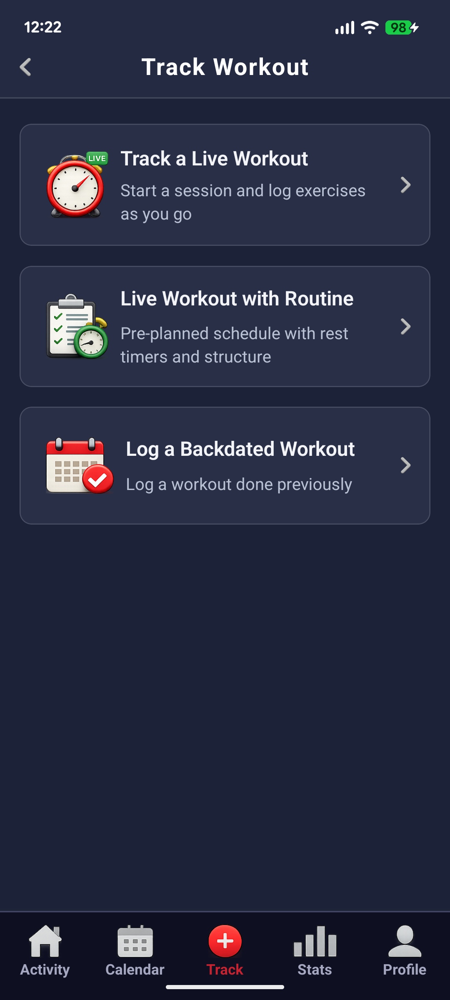<br/><sub>Start a Workout</sub></td>
    <td width="30"></td>
    <td align="center"><br/><sub>Live Workout</sub></td>
    <td width="30"></td>
    <td align="center">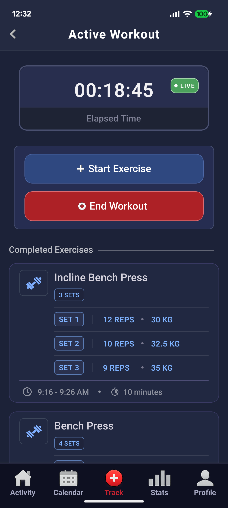<br/><sub>Sets Logged</sub></td>
  </tr>
  <tr>
    <td align="center">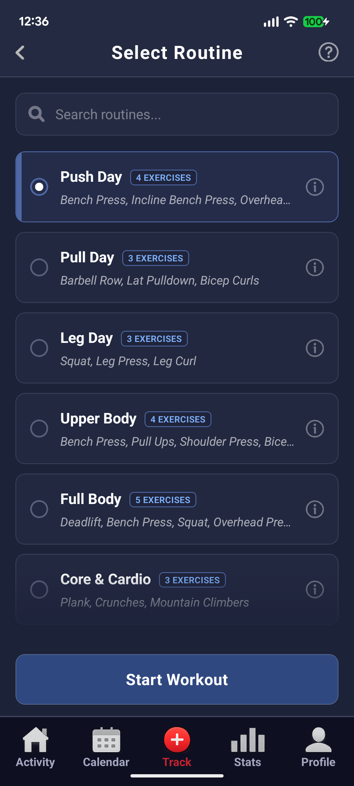<br/><sub>Select Routine</sub></td>
    <td width="30"></td>
    <td align="center">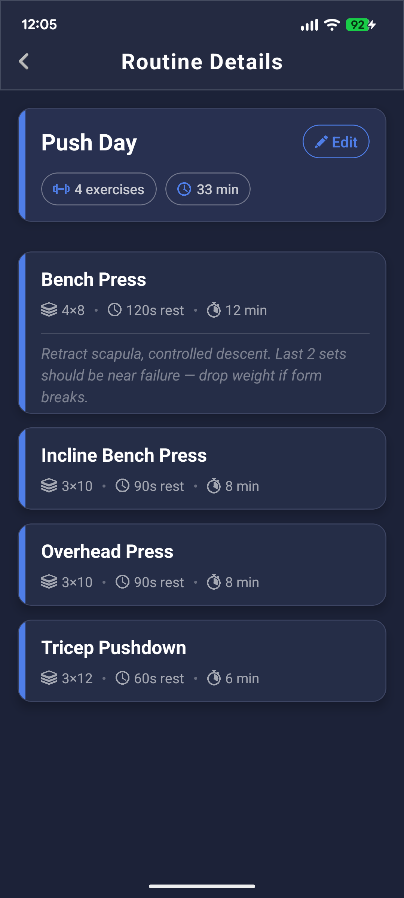<br/><sub>Routine Details</sub></td>
    <td width="30"></td>
    <td align="center">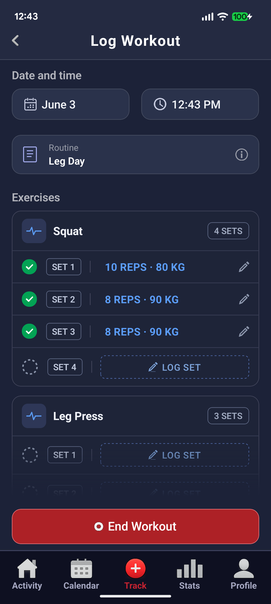<br/><sub>Log a Past Workout</sub></td>
  </tr>
  <tr>
    <td align="center"><br/><sub>Calendar</sub></td>
    <td width="30"></td>
    <td align="center">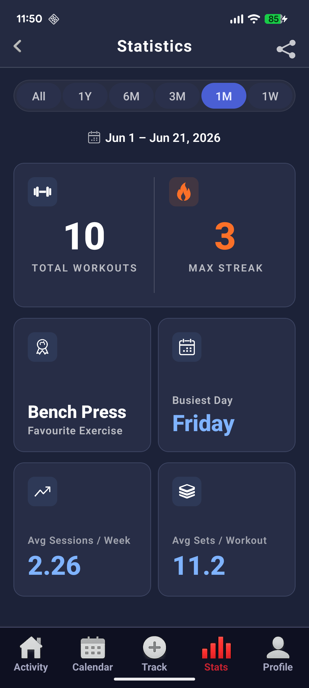<br/><sub>Statistics</sub></td>
    <td width="30"></td>
    <td align="center"><br/><sub>Activity Feed</sub></td>
  </tr>
  <tr>
    <td align="center">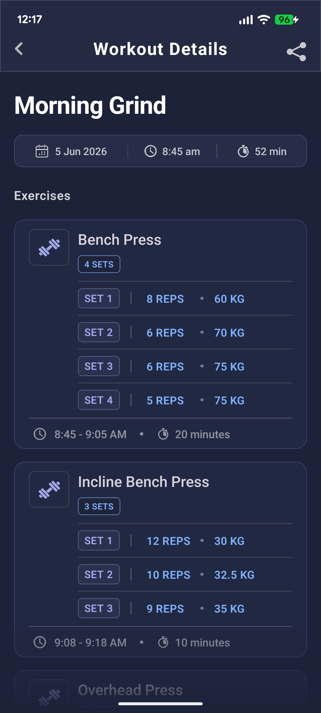<br/><sub>Workout Details</sub></td>
    <td width="30"></td>
    <td align="center">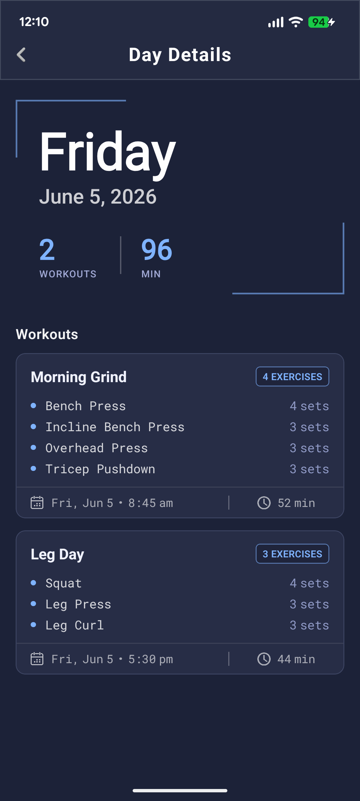<br/><sub>Day Details</sub></td>
    <td width="30"></td>
    <td align="center">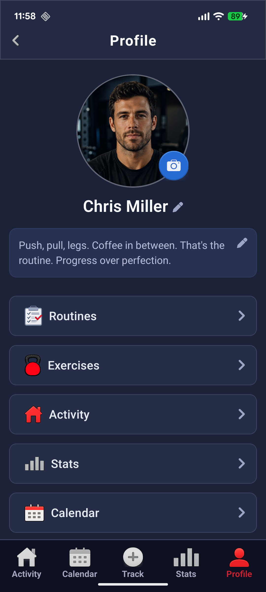<br/><sub>Profile</sub></td>
  </tr>
</table>

## Design Philosophy

FitForge is built around the idea that strength training deserves the same level of tracking rigor that runners get from apps like Strava. The workflow mirrors the reality of training: you have templates (routines), you execute them (live or after the fact), and you want to see if you're getting stronger.

The app supports three workout modes because training doesn't always happen in real-time. You might log a session from yesterday, follow a pre-made routine at the gym, or just do a free-form session. This flexibility matters.

## Technical Approach

FitForge is built with React Native and TypeScript, targeting Android. The app uses React hooks for state management with a focus on clean component composition. Data is persisted locally for offline-first workout logging.

Key decisions include modular screen and component architecture for maintainability, and a deliberate separation of workout data models from UI logic. The app prioritizes responsiveness during live workout sessions, the most critical user moment.

## Getting Started

### Prerequisites

Make sure you have completed the [React Native environment setup](https://reactnative.dev/docs/set-up-your-environment).

### Installation

1. Clone the repository:
```bash
git clone https://github.com/ChinmayKarnik/FitForge.git
cd FitForge
```

2. Install dependencies:
```bash
npm install
```

### Running the App

```bash
npm run android
```

To start the Metro bundler separately:
```bash
npm start
```

## License

This project is licensed under the MIT License.
