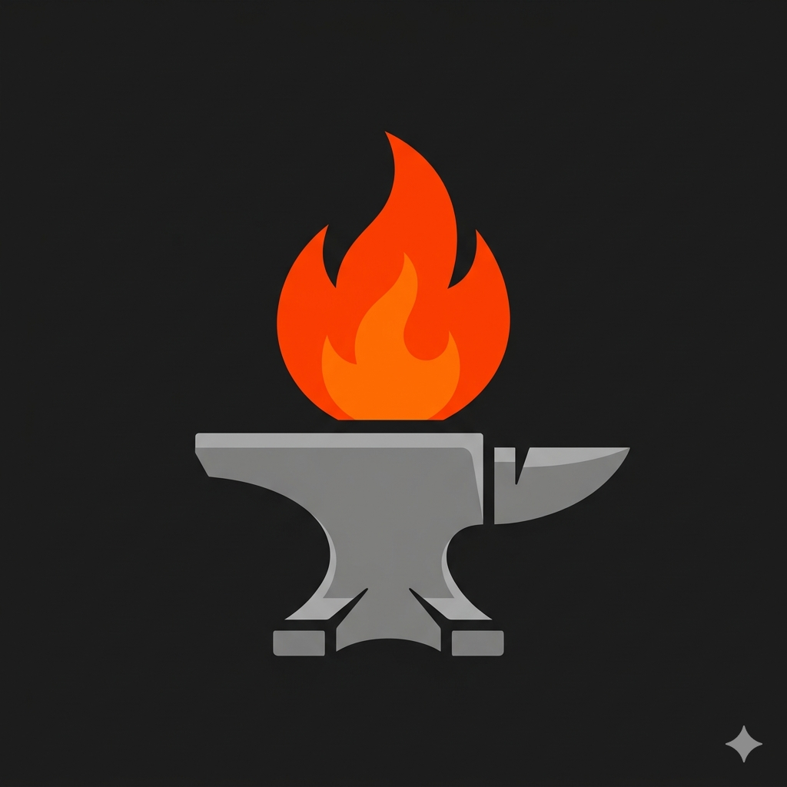

#  FitForge

**Strava for strength training.** A mobile app to log, track, and analyze your weight training workouts. Built with a focus on capturing the nuance of strength training that existing apps miss.

---

## Why FitForge?

There's no good, well-known app dedicated to strength training tracking. Most fitness apps are either running-focused (like Strava) or overly complex with meal plans and macro tracking. FitForge does one thing: help you systematically log your weight training sessions and understand your progress over time.

---

## 💪 Core Features

**Flexible Workout Logging**
- **Live workouts**: Log sets, reps, and weight as you train
- **Backdated workouts**: Add completed workouts after the fact
- **Routine-based workouts**: Save custom routines (push day, pull day, full body, etc.) and reuse them

**📋 Workout Management**
- Create and edit custom routines
- Build your own exercise library in addition to pre-built exercises
- Full CRUD operations for routines and exercises

**📊 Progress Tracking**
- Calendar view: See your workout consistency at a glance
- Stats section: Track progression over days and months
- Detailed workout history

**👤 Profile**
- Customize your profile and upload photos
- Activity feed: See your recent workouts

---

## Design Philosophy

FitForge is built around the idea that strength training deserves the same level of tracking rigor that runners get from apps like Strava. The workflow mirrors the reality of training: you have templates (routines), you execute them (live or later), and you want to see if you're getting stronger.

The app supports three workout modes because training doesn't always happen in real-time. You might log a session you did yesterday, or follow a pre-made routine while training, or just do a free-form session. This flexibility matters.

---

## Technical Approach

FitForge is built with React Native and TypeScript for a single codebase across iOS and Android. The app uses React hooks for state management with a focus on clean component composition. Data persistence is handled locally, allowing offline-first workout logging with sync capabilities.

Key decisions include modular screen and component architecture for maintainability, and a deliberate separation of workout data models from UI logic. The app prioritizes responsiveness during live workout sessions, the most critical user moment.

---

## Screenshots

*Screenshots to be added*

---

## Getting Started

### Prerequisites

Make sure you have completed the [React Native environment setup](https://reactnative.dev/docs/set-up-your-environment).

### Installation

1. Clone the repository:
```bash
git clone https://github.com/yourusername/FitForge.git
cd FitForge
```

2. Install dependencies:
```bash
npm install
```

3. Install iOS dependencies (iOS only):
```bash
bundle install
bundle exec pod install
```

### Running the App

#### iOS
```bash
npm run ios
```

#### Android
```bash
npm run android
```

---

## Development

To start the Metro development server:
```bash
npm start
```

Then run the app in a separate terminal (see Running the App section above).

---

## License

This project is licensed under the MIT License.
